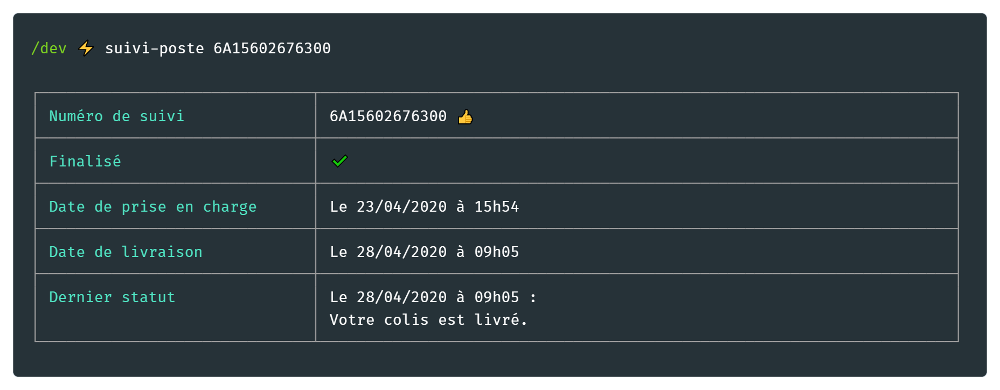

# suivi-poste-cli
> Suivre les envois postaux depuis le terminal



La Poste fourni en Open Data une [API de suivi postal](https://developer.laposte.fr/products/suivi/latest). Ce module permet de consommer cette API directement depuis le terminal.

Les produits supportés sont les suivants :

 - Courriers suivis national
 - Courriers suivis international
 - Colis Colissimo
 - Envois Chronopost


## Installation
```sh
$ yarn global add suivi-poste-cli # or npm i -g suivi-poste-cli
```

## Usage
```
$ suivi-poste --help

  Usage
    $ suivi-poste <tracking_numbers>
  
  Options
    --help --aide -h    Afficher l'aide
    --full              Afficher les informations complètes de suivi
    --raw               Récupérer le résultat brut de l'API au format JSON
    --no-color          Désactiver l'affichage des couleurs
    --api-key="<token>" Clef d'API suivi La Poste à utiliser
    
  Exemple
    $ suivi-poste 4P36275770836
    $ suivi-poste 4P36275770836 --full
    $ suivi-poste 4P36275770836 6T11111111110 114111111111111
    $ suivi-poste 4P36275770836 114111111111111 --no-color
    $ suivi-poste 4P36275770836 --raw --api-key="my-api-key"

  https://github.com/rigwild/suivi-poste
```

## Arguments de commande
| Argument | Description |
| -------- | ----------- |
|  `--help` `--aide` `-h` | Afficher l'aide |
| `--full` | Afficher les informations complètes de suivi |
| `--raw` | Récupérer le résultat brut de l'[API suivi La Poste](https://developer.laposte.fr/products/suivi/latest) au format JSON |
| `--no-color` | Désactiver l'affichage des couleurs |
| `--api-key="<token>"` | Clef d'[API suivi La Poste](https://developer.laposte.fr/products/suivi/latest) à utiliser |

## Note
Afin de faciliter l'utilisation de cet outil, les requêtes sont transmises via un serveur [suivi-poste-proxy](https://gist.github.com/rigwild/c88e5a85fb1f1365cecbbe597dd5dcca) qui injecte sa clef d'[API suivi La Poste](https://developer.laposte.fr/products/suivi/latest) et cache votre adresse IP.

Pour ne pas passer par le [suivi-poste-proxy](https://gist.github.com/rigwild/c88e5a85fb1f1365cecbbe597dd5dcca) et communiquer directement avec l'[API suivi La Poste](https://developer.laposte.fr/products/suivi/latest), générez votre propre clef d'API en mode production et utilisez l'argument de commande `--api-key="<token>"`.

Il faut s'inscrire sur le portail [developer.laposte.fr](https://developer.laposte.fr) pour générer une clef d'API.

## Associés
 - [suivi-poste](https://github.com/rigwild/suivi-poste) - API pour ce module
 - [suivi-poste-proxy](https://gist.github.com/rigwild/c88e5a85fb1f1365cecbbe597dd5dcca) - Serveur proxy pour ce module

## Licence
[Licence MIT](./LICENSE)
